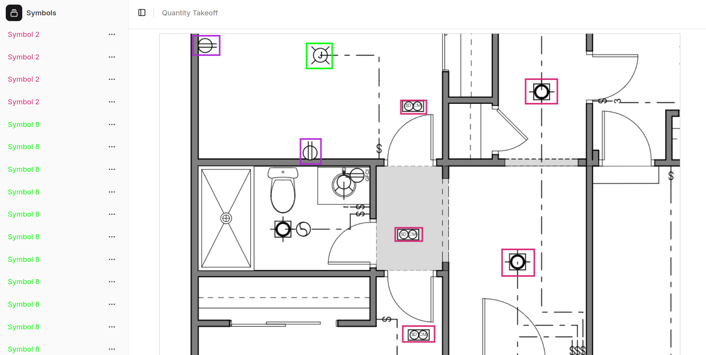

# AI powered Construction Quantity TakeOff Application 

## Overview

TakeOff is an application to perform [quantity takeoff of construction drawings](https://www.procore.com/library/construction-material-takeoff). In this project, we use Dino along with Yolov8 model to perform detection of symbols in the drawings and then estimate the quality of symbols present in legend of the drawings. 

<p align="center">
  
</p>


## Prerequisites

- **Docker Engine**: Ensure Docker is installed on your machine.
- **Docker Compose**: Make sure Docker Compose is available.
- **Node.js**: For local frontend development (if needed).
- **Python**: For local backend development (if needed).

## Installation and Setup

1. **Clone the Repository**

   ```bash
   git clone https://github.com/govinkw9-projects/quantity_takeoff.git
   cd quantity_takeoff
   ```

2. **Setup Environment Files**

   - Create and configure the `.env_Frontend` file with the required environment variables for the frontend.
   - Create and configure the `.env_Backend` file for the backend.
   - Adjust other configuration files such as `php.ini`, and ensure that the `nginx` directory contains your custom configuration and SSL certificates.

3. **Build and Start the Application**

   Use Docker Compose to build and run the application:

   ```bash
   docker-compose up --build
   ```

   The command builds images from the specified Dockerfiles and starts all containers based on the defined dependencies.

## Usage

### Accessing the Application

- **Frontend:** Accessible at [http://localhost:3000](http://localhost:3000) (depending on your Nginx configuration, this might also be accessible via the proxy on port 8080).
- **Backend API:** Accessible at [http://localhost:8000](http://localhost:8000).
- **Nginx Reverse Proxy:** For HTTP traffic, access [http://localhost:8080](http://localhost:8080). For HTTPS, ensure you have your SSL certificates in place.
- **phpMyAdmin:** Accessible at [http://localhost:8081](http://localhost:8081) for managing your MySQL databases.

### Stopping and Restarting

To stop your application, you can use:

```bash
docker-compose down
```

To restart:

```bash
docker-compose up -d
```

## Contributing

Contributions are welcome! If you find a bug or have a feature request, please open an issue or submit a pull request. Follow the repository guidelines and ensure that any changes are well-documented and tested.

## License

This project is licensed under the MIT License. See the [LICENSE](LICENSE) file for details.

---

By following these steps and guidelines, developers and operators can quickly get the TakeOff Application running in their own environment. For additional support or questions, please refer to the project's issue tracker or contact the maintainers.

---